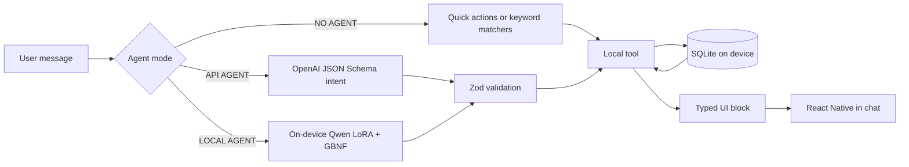

# AiBudget

**Privacy-first expense tracker with a financial assistant that answers in charts, tables and budget cards, not walls of text.** **There is no AiBudget backend:** no accounts, no cloud ledger and we do not store your spending or chat on any server. Data lives in **SQLite on your device** (browser storage for this demo). On the **native app**, a fine-tuned, no-cost on-device model powers fully offline chat.

**This page is the [browser demo](https://paologhidoni.github.io/ai-budget/).** You get the same UI and **Chat** flows as on native, but the on-device **LoRA** model cannot run in a browser. **Quick actions** work here without an API key; free-text chat needs **your OpenAI key** in **Settings → Agent** (or install the **native** build for fully offline local AI).

<a href="https://paologhidoni.github.io/ai-budget/" target="_blank" rel="noopener noreferrer"><strong>Live demo</strong></a> (running in browser)

<a href="https://paologhidoni.github.io/ai-budget/media/demo.mp4" target="_blank" rel="noopener noreferrer"><strong>Demo video</strong></a> (of the native app)

[**Android APK**](https://expo.dev/accounts/ordinae/projects/ai-budget/builds/507559a7-14a2-45c8-bbd7-aa6d251318ef) (installable on devices)

<a href="https://huggingface.co/pablitoelpeligro/aibudget-intent-05b-GGUF" target="_blank" rel="noopener noreferrer"><strong>LoRA v5 GGUF</strong></a> (Hugging Face)

`React Native` `Expo` `TypeScript` `SQLite` `Zod` `llama.rn` `LoRA` `Vitest`

<video src="https://paologhidoni.github.io/ai-budget/media/demo.mp4" controls width="720" playsinline></video>

---

## Try it in 60 seconds

No sign-up, no AiBudget account and no API key needed for **Quick actions**. Nothing you enter is sent to an AiBudget server because there is not one.

1. Open the <a href="https://paologhidoni.github.io/ai-budget/" target="_blank" rel="noopener noreferrer">live demo</a> and finish the short onboarding. **Five months of sample spending** (this month and the four before it) loads automatically on first visit so charts are not empty.
2. Go to **Chat** and tap **Spending breakdown** (or another **Quick action**).
3. Notice the answer is a **typed UI block** (chart, list or budget card), not only text. That is the Generative UI layer below.
4. Browse **Dashboard**, **Transactions** and **Budgets**.

### Browser demo

The browser demo shows the same **Chat** UI and **Quick actions**, but it does **not** run the on-device **LoRA** model. **Free-text** chat on web uses **OpenAI mode** (your key). Add your key in **Settings → Agent**, or use **Quick actions** without a key. Use **one tab at a time**; if init fails, close other AiBudget tabs and reload (or open in Chrome/Safari, not an in-app browser).

**Try asking in Chat** (after sample data loads):

- “How much did I spend this month?”
- “How much did I spend on Vinted?”

You should get a chart, table or summary card, not only plain text.

### Native Android build

The full **local-agent** experience (on-device model via [llama.rn](https://github.com/mybigday/llama.rn)) is on the [**installable Android build**](https://expo.dev/accounts/ordinae/projects/ai-budget/builds/507559a7-14a2-45c8-bbd7-aa6d251318ef), not in the browser.

---

## Highlights

- **No backend.** The app has **no server** for transactions, budgets or chat history. No sync, no telemetry pipeline to the developer and no database you do not control. Optional **API AGENT** mode calls **OpenAI** with **your** API key from the device; that traffic goes to OpenAI, not through an AiBudget-hosted API.
- **On-device AI agent (native).** **Qwen 2.5 0.5B**, fine-tuned with **LoRA** and merged to **GGUF**, runs on the phone via [llama.rn](https://github.com/mybigday/llama.rn), constrained by a **GBNF** grammar so completions stay on the intent schema.
- **Measured, not vibes.** On a fixed 75-question holdout (model only, no keyword fallbacks), task success went from **51% to 95%** and confidently wrong answers from **35% to 4%**. Valid structured output rose from **57%** to **100%** after LoRA.
- **Human feedback on chat turns (internal builds).** In dev and EAS preview builds only, **Chat** shows **Correct** / **Wrong** under each assistant reply, with a short note when something is wrong. Labels export from Settings for offline model QA, not in the browser demo or production APK.
- **Generative UI.** The assistant decides _what_ to show; typed React Native components decide _how_ it looks. Charts, lists, trend bars and budget widgets render from structured payloads, not model-generated markup.
- **Safe execution path.** Raw ledger rows and SQL never go through the model. Tools query SQLite locally and build chart/table props in app code. The LLM (when used) only proposes a small **structured intent**, validated with **Zod** (OpenAI **JSON Schema** in API mode, **GBNF** in LOCAL mode).
- **Tested contract.** Automated tests keep cloud API, on-device and Quick-action paths on the same intents and local tools.

---

## Generative UI

Chat answers are interfaces. Ask for a **spending breakdown by category** and you get a **pie chart**. Ask **how much you spent on groceries this month** and you get a **summary stat card**. Ask **show my budget status** and you get **budget cards** (after you set budgets in the app).

**How it works**

1. A **structured intent** is produced (on-device model, OpenAI, chat **Quick actions** or offline keyword/locale matchers).
2. The intent maps to a **local tool** that queries **SQLite** on the device.
3. The tool result becomes a **typed UI block** (pie chart, transaction list, monthly bars, budget cards and others).
4. React Native renders the block in the chat thread.

**Design choices**

- **Controlled Generative UI.** The assistant selects from a fixed catalog of components. There is no model-generated markup, so output is predictable, testable and consistent with the app design.
- **The model routes; the app supplies data.** In many generative-UI setups the LLM fills component props and therefore sees the data. Here it picks a tool and parameters; **local tools** assemble props from SQLite. That boundary is what keeps **LOCAL AGENT** private.
- **One tool layer, three modes.** **NO AGENT**, **API AGENT** and **LOCAL AGENT** share the same tools and UI blocks. API and LOCAL (and Quick actions) use the same intent schema; offline free-text can route via matchers without calling a model.

_Pattern inspired by DeepLearning.AI's [Build Interactive Agents with Generative UI](https://www.deeplearning.ai/courses/build-interactive-agents-with-generative-ui). AiBudget sits on the controlled end of that spectrum: custom intent schema and React Native widgets._

---

## Results: LoRA fine-tuning on a 0.5B model

Prompting and deterministic rules only take a 0.5B model so far. I ran a full **LoRA** cycle on **Qwen 2.5 0.5B** so the on-device model learns the app's **structured intent JSON** (multilingual, schema-bound), then merged adapters to **GGUF** for inference in the app.

Each training round is checked against a fixed **holdout** of 75 realistic agent questions, with limits on **confidently wrong** answers (the model sounds sure but picks the wrong action). The table below is **model-only**: no keyword or rule shortcuts layered on top.

| Stage                          | Task success | Confidently wrong | Valid structured output |
| ------------------------------ | ------------ | ----------------- | ----------------------- |
| Base 0.5B (raw)                | 51%          | 35%               | 57%                     |
| LoRA v1 (first ship candidate) | 88%          | 12%               | 100%                    |
| **LoRA v5 (shipped in app)**   | **95%**      | **4%**            | **100%**                |

The version users download in Settings is **v5**, the holdout winner. Later training runs (v6 through v10) did not beat it on the metrics I cared about.

**Weights:** the shipped **v5** merged **GGUF** is on [Hugging Face](https://huggingface.co/pablitoelpeligro/aibudget-intent-05b-GGUF). Published artifact: fused, quantized **GGUF** only. LoRA adapter weights are not in that repository.

**Caveats.** The holdout is 75 questions, so treat percentages as indicative. Extra keyword routing in the app can push accuracy higher on paper; the table above is what the **base** and **LoRA** models do on their own. I can share eval methodology on request.

---

## Human feedback (dev and preview only)

To improve the assistant with real chat examples, not just the fixed holdout, I added a **human feedback** flow that stays out of end-user builds.

| Aspect    | Detail                                                                                       |
| --------- | -------------------------------------------------------------------------------------------- |
| Where     | **Chat** only, under each finished assistant message                                         |
| Builds    | Local **development** (Expo Go / dev client) and **EAS preview** or **development** channels |
| Hidden on | Public **browser demo**, portfolio **APK** and other production-style releases               |

**How it works**

1. Tap **Correct** if the answer and UI block match what you wanted.
2. Tap **Wrong** if the model mis-routed or the result is off. A **free-text field** appears so you can say what you expected (required before saving a wrong rating).
3. Each rating is stored **locally in SQLite** with the user message, assistant reply, agent mode and the structured **intent trace** for that turn.

Testers can **export** labeled turns as **JSONL** from **Settings → Developer** (`Export agent feedback`) for offline review when tuning LoRA and routing. Nothing is uploaded to an AiBudget backend.

---

## Architecture

The model does not hold your ledger. It suggests _which tool to run with which parameters_ (when an LLM is in the loop); the app executes SQL and renders.

There is **no box for an AiBudget server** in the diagram on purpose. The only remote pieces are ones **you** opt into (for example OpenAI in **API AGENT** mode, or downloading the GGUF from Hugging Face). The [browser demo](https://paologhidoni.github.io/ai-budget/) is a **static** export on GitHub Pages; it does not receive your data.

---

## Agent modes

| Mode                          | How intent is extracted                                                 | Privacy                                                                                                                                                            |
| ----------------------------- | ----------------------------------------------------------------------- | ------------------------------------------------------------------------------------------------------------------------------------------------------------------ |
| **NO AGENT**                  | Quick actions, keyword / locale matchers; offline                       | Nothing leaves the device                                                                                                                                          |
| **LOCAL AGENT** (native only) | Fine-tuned on-device model + GBNF                                       | Nothing leaves the device                                                                                                                                          |
| **API AGENT**                 | OpenAI returns JSON matching a strict schema; optional narration stream | Your message and context go to OpenAI for intent; narration may receive **aggregates only** (totals, top categories, budget summaries; not full transaction lists) |

**SQL and the full ledger stay on the device** in every mode. **API AGENT** is still a cloud compromise for intent (and optional prose polish), not equivalent to **LOCAL AGENT** privacy.

---

<strong>Web demo vs native</strong>

The web build is for trying flows in a browser, not a pixel-perfect copy of the native UI. Small visual differences are expected.

| Capability                       | Web demo              | Native (EAS preview) |
| -------------------------------- | --------------------- | -------------------- |
| Dashboard, budgets, transactions | Yes                   | Yes                  |
| Chat Quick actions / NO AGENT    | Yes                   | Yes                  |
| API AGENT (your OpenAI key)      | Yes                   | Yes                  |
| LOCAL AGENT (on-device model)    | No                    | Yes                  |
| Secure credential storage        | `localStorage` (demo) | SecureStore          |
| Camera receipt scan              | Limited               | Feature-flagged      |
| Biometric app lock               | No                    | Yes                  |

**Native install:** the portfolio APK is a production-style build without dev-only menus. Internal testers use a separate preview build with extra developer tools (including **Correct** / **Wrong** feedback on **Chat** and feedback export in Settings).

---

## Tech stack

- **React Native + Expo 57**: one codebase for iOS, Android and web
- **Expo Router** for navigation
- **expo-sqlite** (WASM on web) for persistence
- **Zustand** for app state
- **Zod** for agent intent contracts
- **llama.rn** for on-device GGUF inference
- **Victory Native / Skia** on native; **SVG fallbacks** on web
- **Vitest** for agent intent and routing tests
- **GitHub Pages** static hosting with SPA routing under `/ai-budget/`

---

## Limitations

- **Browser storage (SQLite / OPFS).** The web build persists data with **expo-sqlite** over **OPFS**. Use **one tab at a time** (close other AiBudget tabs). **Private windows** and **in-app browsers** (LinkedIn, Instagram, etc.) can also block init. Open the demo in **Chrome or Safari**, or clear site data for `paologhidoni.github.io` and reload. GitHub Pages does not send the `COOP`/`COEP` headers Expo recommends for SQLite on web; a future host with those headers may be more reliable.
- **No backend (by design).** AiBudget is a client-only app. Your ledger, budgets and chat threads are not uploaded to an AiBudget service, logged on a central database or visible to the project author. They stay on the device (browser **OPFS** / `localStorage` for this demo). There is no cloud sync and no account recovery from our side because we never hold a copy.
- **Web demo API key.** In API AGENT mode on web, your OpenAI key is stored in `localStorage` inside a public static JS bundle, which is less safe than native SecureStore. The app never sends the key to an AiBudget server (there is none). Use a key you control, or **NO AGENT** / **LOCAL AGENT** for stronger privacy. Usage is billed to your OpenAI account.
- **Small model.** A 0.5B model has limits even after fine-tuning (95% on a 75-question holdout, not 100%).

---

## About the source

Application source lives in a **private** repository. This <a href="https://paologhidoni.github.io/ai-budget/" target="_blank" rel="noopener noreferrer">live demo</a> is the same React Native app exported for the web. Pushes to `main` in that repo publish a static build and this README to the public [paologhidoni/ai-budget](https://github.com/paologhidoni/ai-budget) `gh-pages` branch. Happy to walk through architecture, evals or share access on request.
